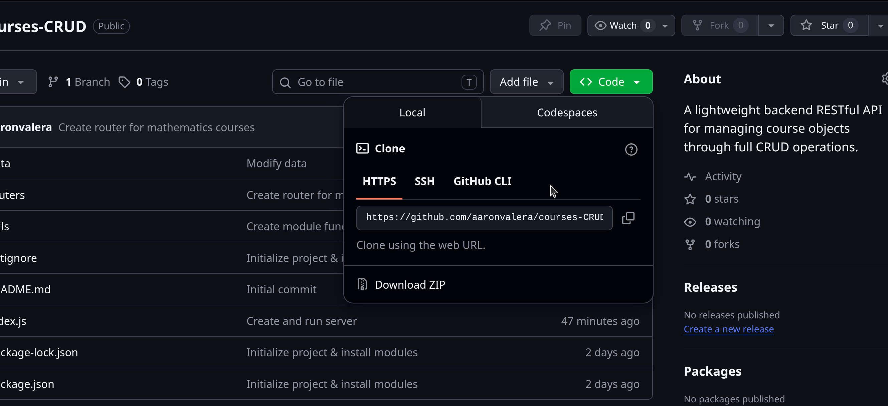
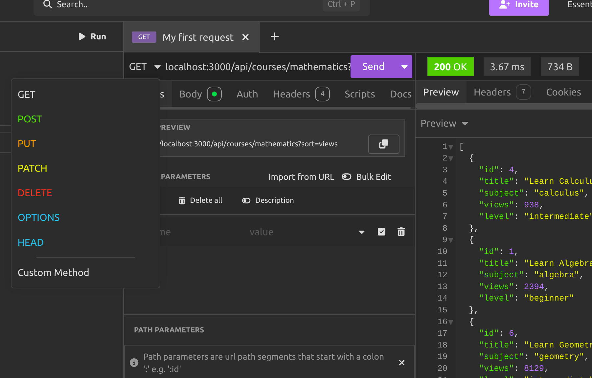
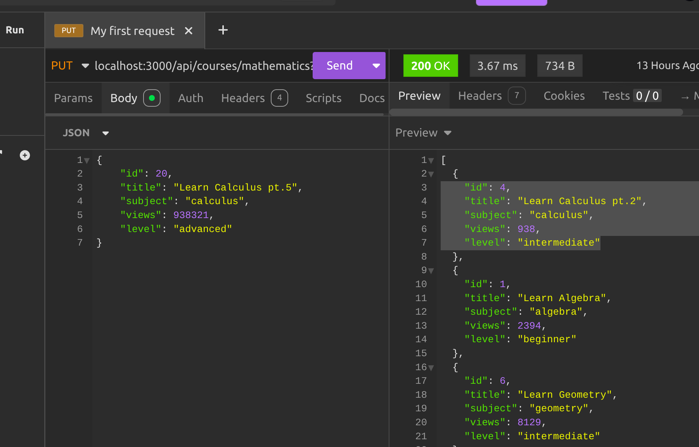

# Courses CRUD API

This project is a RESTful API built with **Node.js** and **Express** that allows you to manage data(Mathematics and Programming courses) using standard HTTP methods (GET, POST, PUT, PATCH, DELETE).

---

## Index
1.[Prerequisites](#prerequisites)
2.[Installation and Setup](#installation-and-setup)
3.[Available Endpoints](#available-endpoints)
    3.1 [Programming Module](#programming-module)
    3.2 [Mathematics Module](#mathematics-module)
4.

## Prerequisites

Before getting started, make sure you have the following installed:
* [Node.js](https://nodejs.org/) (Version 14 or higher)
* NPM (Installed automatically with Node)
* [Git](https://git-scm.com/)
* [Insomnia](https://insomnia.rest/)

---

## Installation and Setup

Follow these steps to run the server locally:

1. **Clone the repository:**

Click on the green **"Code"** button on this GitHub repo, copy the https method:



After that, copy the following code in your terminal (bash/powershell):

1. **Clone the repository**

    ```bash/powershell
    git clone <repository-url>
    cd <folder-name>
    ```

2. **Install the necessary dependencies**

    ```bash/powershell
    npm install
    ```
3. **Start the Server**

    ```bash/powershell
    node index.js
    ```
---

## How to use **Insomnia** 

1. **Create Request:** Select the HTTP method (GET, POST, PUT, PATCH, DELETE) and the corresponding URL.



2. **Configure Body:** If you are using POST/PUT/PATCH, click on the **Body** tab, select **JSON** and configure the object.



## Available Endpoints

### Programming Module

**Root**: http://localhost:3000/api/courses/programming

| Method | Endpoint | Description | Requisites & Outputs |
| :--- | :--- | :--- | :--- |
| **GET** | `/` | Returns the full list of programming courses. | **Success:** `200 OK` |
| **GET** | `/?sort=views` | Returns the full list of programming courses sorted by views from least to most. | **Success:** `200 OK` |
| **GET** | `/:language` | Filters courses by language (example: `javascript`). | **Error:** `404` if the language is not found. |
| **GET** | `/:language/:level` | Filter courses by language and difficulty level (example: `beginner`). | **Error:** `404` if there are no matches. |
| **POST** | `/` | Registers a new course in the database. | **Body:** JSON with the properties of the course. **Error:** `400` if the ID is repeated. |
| **PUT** | `/:id` | Replaces an existing course in its entirety. | **Body:** entire JSON. **Error:** `404` if the ID is not found. |
| **PATCH** | `/:id` | Modifies specific properties of a course. | **Body:** JSON with properties to update. **Error:** `404` if the ID is not found. |
| **DELETE** | `/:id` | Removes a course from the database based on its ID. | **Error:** `404` if the ID is not found. |

### Mathematics Module

**Root:** http://localhost:3000/api/courses/mathematics

| Method | Endpoint | Description | Requisites & Outputs |
| :--- | :--- | :--- | :--- |
| **GET** | `/` | Returns the full list of mathematics courses. | **Success:** `200 OK` |
| **GET** | `/?sort=views` | Returns the full list of mathematics courses sorted by views from least to most. | **Success:** `200 OK` |
| **GET** | `/:subject` | Filters courses by language (example: `javascript`). | **Error:** `404` if the subject is not found. |
| **GET** | `/:subject/:level` | Filter courses by language and difficulty level (example: `beginner`). | **Error:** `404` if there are no matches. |
| **POST** | `/` | Registers a new course in the database. | **Body:** JSON with the properties of the course. **Error:** `400` if the ID is not found. |
| **PUT** | `/:id` | Replaces an existing course in its entirety. | **Body:** entire JSON. **Error:** `404` if the ID is not found. |
| **PATCH** | `/:id` | Modifies specific properties of a course. | **Body:** JSON with properties to update. **Error:** `404` if the ID is not found. |
| **DELETE** | `/:id` | Removes a course from the database based on its ID. | **Error:** `404` if the ID is not found. |

---

## Client Request Examples

### GET (Filter by views from least to most)
`GET http://localhost:3000/api/courses/programming?sort=views`

### DELETE (Delete course)
`DELETE http://localhost:3000/api/courses/mathematics/5`

### POST (Create course)
`POST http://localhost:3000/api/courses/programming`
```json
{
  "id": 8,
  "title": "Learn TailwindCSS",
  "language": "css",
  "views": 25000,
  "level": "beginner"
}
```

### PUT (Modify course in its entirety)
`PUT http://localhost:3000/api/courses/mathematics/2`
```json
{
  "id": 2,
  "titulo": "Calculus pt.6",
  "tema": "calculus",
  "vistas": 543932,
  "nivel": "advanced"
}
```

### PATCH (Update course partially)
`PATCH http://localhost:3000/api/courses/programming/1`
```json
{
  "vistas": 85000
}
```